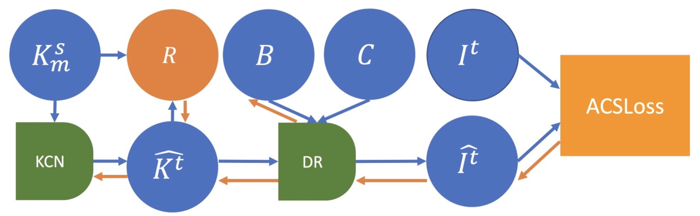
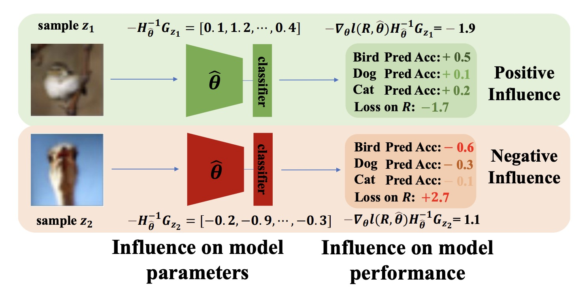

# [Hao Ding's Personal Website](https://hding2455.github.io)

Welcome to my personal website! I am a Ph.D. candidate at the Department of Computer Science, Johns Hopkins University. My work focuses on computer vision and surgical robotics. Feel free to explore my research, projects, and publications!

---

## About Me
I am currently Ph.D. candidate at the Department of Computer Science, Johns Hopkins University. My research interests include:
- **[Robust low-level processing of surgical videos]** 
- **[Robust high-level analysis of surgical videos]**
- **[Robust Surgical Automation]**

My mission is to develop a digital twin-based framework that relies on robust low-level processing of vision perceptions to ensure the robustness of high-level surgiacl analysis and automation.

---

## Publications & Ongoing Projects
Below are some of my selected publications and ongoing projects. For a full list, visit my [Google Scholar profile](https://scholar.google.com/citations?user=NIP-G-cAAAAJ&hl=en&oi=sra).

### **Digital Twin-based Robust Surgical Automation**

#### **Towards Robust Automation of Surgical Systems via Digital Twin-based Scene Representations from Foundation Models**
Submitted to ICRA 2025, [paper link](https://arxiv.org/abs/2409.13107).

---

### **Digital Twin-based Robust Surgical Video Analysis**

#### **Towards Robust Algorithms for Surgical Phase Recognition via Digital Twin-based Scene Representation**
Submitted to IPCAI 2025, [paper link](https://arxiv.org/abs/2410.20026).

#### **Neural Finite-State Machine for Surgical Phase Recognition** ####
[paper link]().

---
### Robust Low-level Processing of Surgical Videos

#### **Performance and Non-adversarial Robustness of the Segment Anything Model 2 in Surgical Video Segmentation**

Accepted by SPIE2025, [paper link](https://arxiv.org/abs/2408.04098).

#### **SegSTRONG-C: Segmenting Surgical Tools Robustly On Non-adversarial Generated Corruptions -- An EndoVis'24 Challenge**

MICCAI2024 EndoVis Challenge, [paper link](https://arxiv.org/abs/2407.11906) and [challenge website](https://segstrongc.cs.jhu.edu/).

#### **Rethinking causality-driven robot tool segmentation with temporal constraints**

Published in IPCAI2023, [paper link](https://link.springer.com/article/10.1007/s11548-023-02872-8). 

  

#### **Carts: Causality-driven robot tool segmentation from vision and kinematics data**

Published in MICCAI2022, [paper link](https://link.springer.com/chapter/10.1007/978-3-031-16449-1_37). 

  

---

### **Digital twins as a unifying framework for surgical data science: the enabling role of geometric scene understanding**

Published in Artificial Intelligence Surgery, [paper link](https://www.oaepublish.com/articles/ais.2024.16). 

  

---

### **Influence selection for active learning**

Published in ICCV2021, [paper link](https://openaccess.thecvf.com/content/ICCV2021/html/Liu_Influence_Selection_for_Active_Learning_ICCV_2021_paper.html). 

  

---

### **Deeply shape-guided cascade for instance segmentation**

Published in CVPR2021, [paper link](https://openaccess.thecvf.com/content/CVPR2021/html/Ding_Deeply_Shape-Guided_Cascade_for_Instance_Segmentation_CVPR_2021_paper.html). 

  

<!-- ## Awards and Achievements
- **Award Name (Year)**: Brief description of the award or recognition.
- **Fellowship Name (Year)**: Brief description of the fellowship or grant.
- **Achievement Name (Year)**: Brief description of the achievement.

--- -->

## Contact
Feel free to reach out to me via:
- **Email**: [hding15@jhu.edu](mailto:hding15@jhu.edu)
- **LinkedIn**: [Hao Ding](https://www.linkedin.com/in/hao-ding-7280b9107/)
- **GitHub**: [hding2455](https://github.com/hding2455)

---

## Acknowledgments
Thank you for visiting my website. For feedback or inquiries, don’t hesitate to contact me!
